# EliteCuts - Sistema de Turnos para Barberia

Sistema web full-stack para la gestion de turnos de una barberia. Permite a los clientes reservar turnos online y a los administradores gestionar la agenda, turnos y clientes desde un panel dedicado.


---

## Capturas de Pantalla

### Landing Page

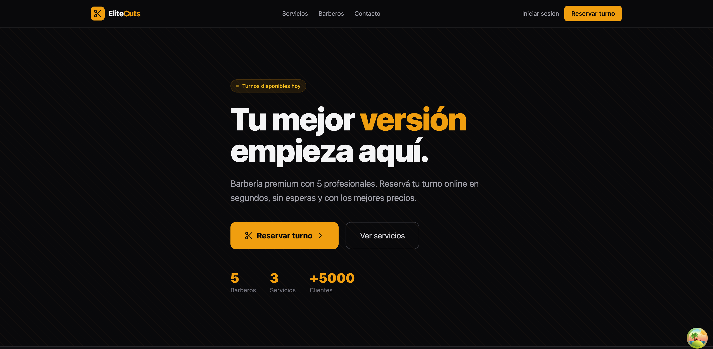

### Autenticacion

| Login | Registro |
|:---:|:---:|
| 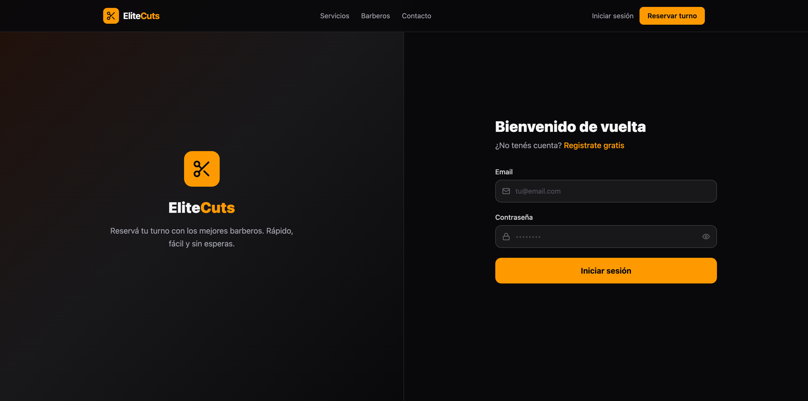 | 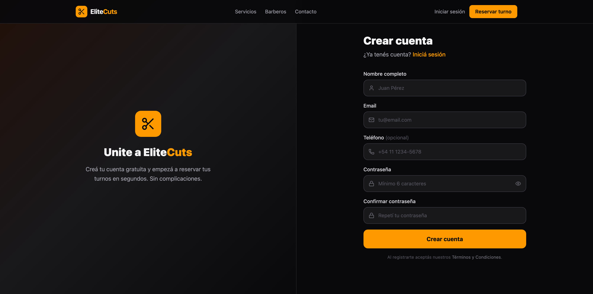 |

### Reserva de Turno

| Seleccion de Servicio | Seleccion de Barbero |
|:---:|:---:|
| 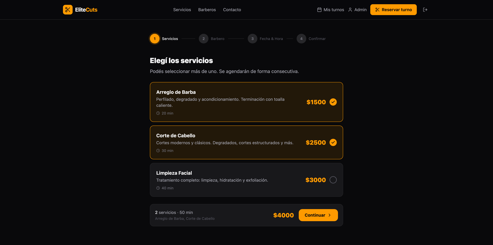 | 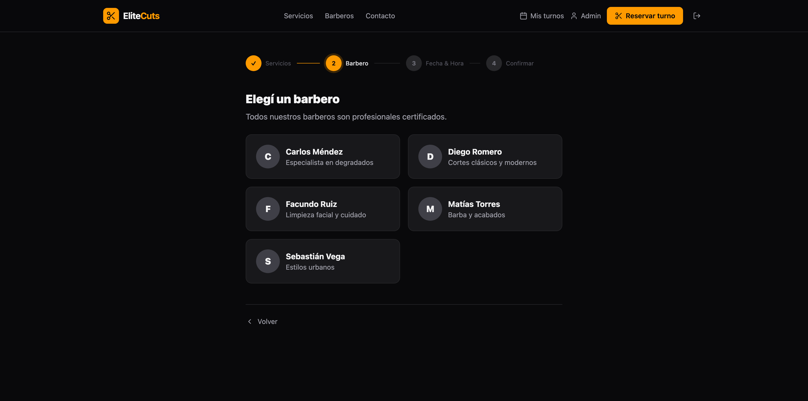 |

| Fecha y Hora | Confirmacion |
|:---:|:---:|
| 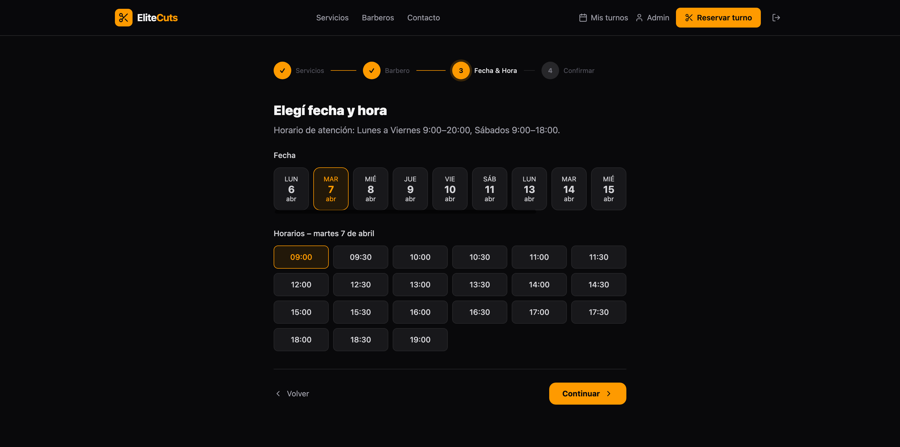 | 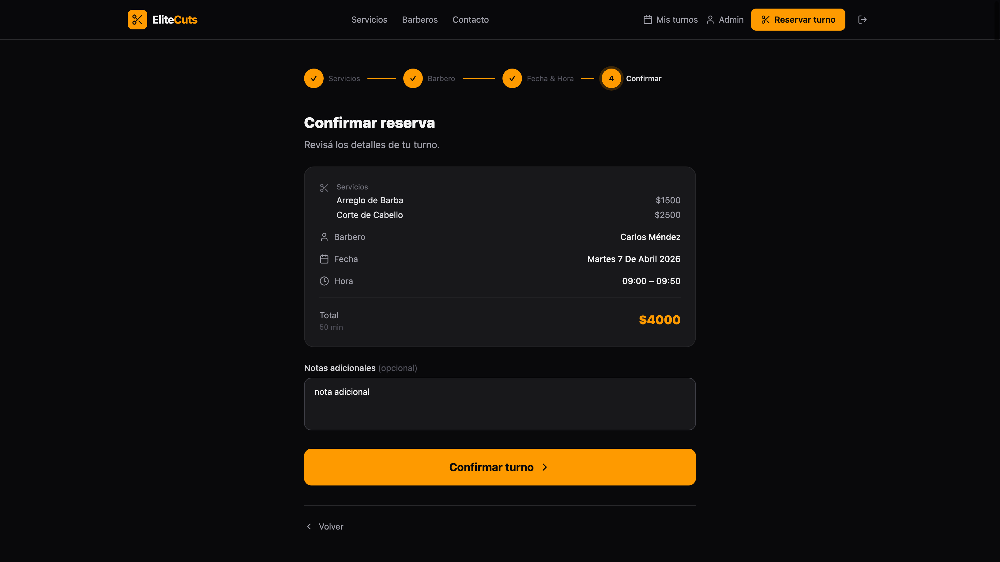 |

### Mis Turnos

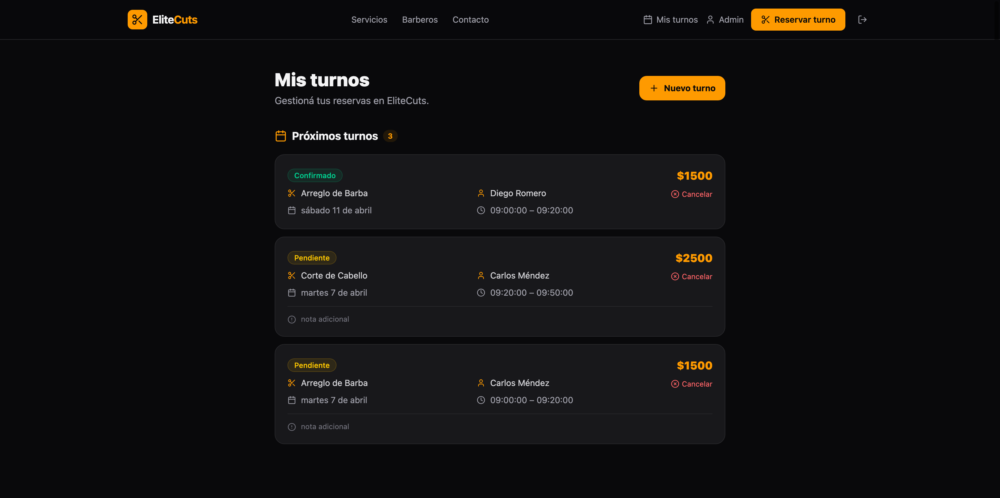

### Panel de Administracion

| Dashboard | Agenda Semanal |
|:---:|:---:|
| 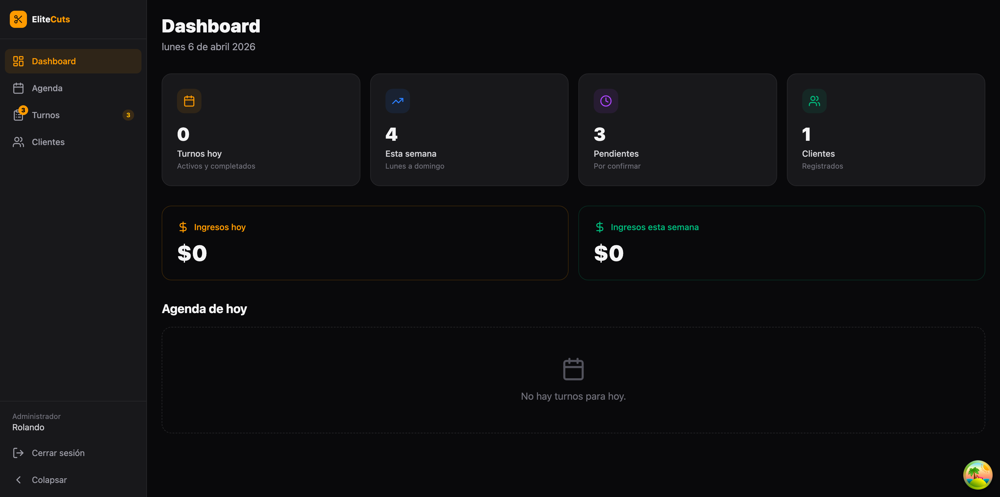 | 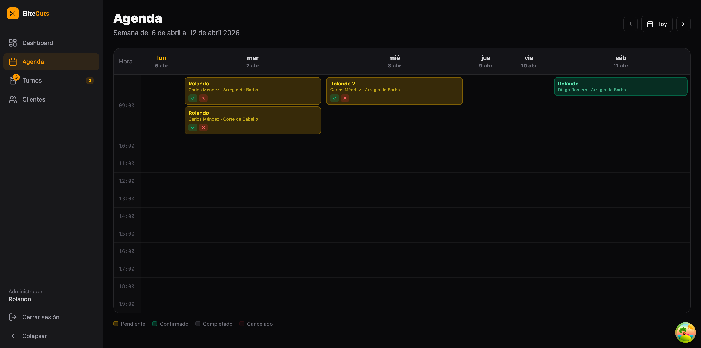 |

| Gestion de Turnos | Clientes |
|:---:|:---:|
| 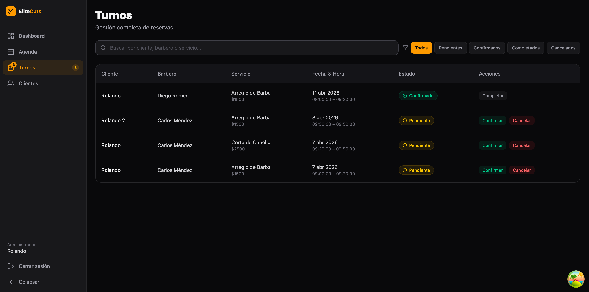 | 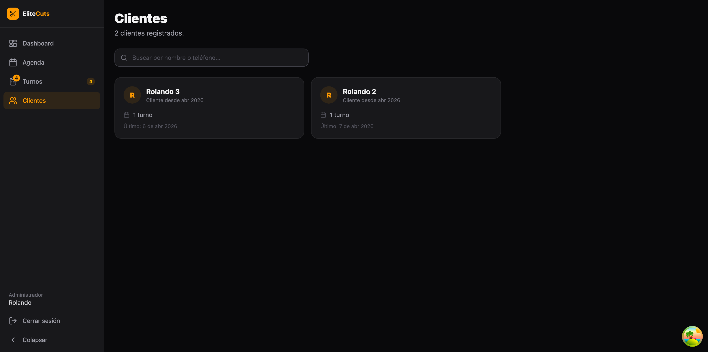 |

---

## Funcionalidades

### Clientes

- Registro e inicio de sesion con email y password
- Flujo de reserva paso a paso: servicio, barbero, fecha/hora y confirmacion
- Visualizacion de turnos activos e historial
- Cancelacion y eliminacion de turnos

### Administradores

- Dashboard con metricas clave (turnos del dia, ingresos, pendientes)
- Calendario semanal con la agenda de cada barbero
- Gestion completa de turnos con cambio de estado
- Listado y gestion de clientes

---

## Tech Stack

| Capa | Tecnologia |
|---|---|
| **Frontend** | React 19, TypeScript, React Router 7 |
| **Estilos** | Tailwind CSS 4 |
| **Estado cliente** | Zustand |
| **Estado servidor** | TanStack React Query |
| **Backend / DB** | Supabase (PostgreSQL, Auth, RLS, Realtime) |
| **Build** | Vite 8 |
| **Iconos** | Lucide React |
| **Fechas** | date-fns |
| **Testing** | Vitest, Testing Library |

---

## Estructura del Proyecto

```
src/
├── features/
│   ├── landing/              # Landing page publica
│   ├── auth/
│   │   ├── login/            # Inicio de sesion
│   │   └── register/         # Registro de usuario
│   ├── booking/
│   │   ├── new/              # Wizard de reserva de turno
│   │   └── my-appointments/  # Turnos del cliente
│   └── admin/
│       ├── dashboard/        # Metricas y resumen
│       ├── schedule/         # Calendario semanal
│       ├── appointments/     # Gestion de turnos
│       └── customers/        # Gestion de clientes
├── shared/
│   ├── components/           # AuthProvider, Layout, ProtectedRoute
│   ├── hooks/                # useAuth, useBarbers, useCatalog
│   ├── services/             # Servicios de Supabase (appointments, barbers, catalog)
│   ├── stores/               # Zustand stores
│   ├── lib/                  # Cliente Supabase, tipos de DB, query keys
│   └── types/                # Interfaces TypeScript
├── test/                     # Setup de Vitest y helpers de mock
├── router/                   # Rutas y lazy loading
└── assets/
```

---

## Requisitos Previos

- **Node.js** >= 18
- **npm** o **pnpm**
- Una cuenta en [Supabase](https://supabase.com) con un proyecto creado

---

## Instalacion

1. **Clonar el repositorio**

```bash
git clone https://github.com/tu-usuario/elite-cuts.git
cd elite-cuts
```

2. **Instalar dependencias**

```bash
npm install
```

3. **Configurar variables de entorno**

```bash
cp .env.example .env
```

Completar el archivo `.env` con las credenciales de tu proyecto de Supabase:

```env
VITE_SUPABASE_URL=https://tu-proyecto.supabase.co
VITE_SUPABASE_ANON_KEY=tu-anon-key
```

4. **Configurar la base de datos**

Ejecutar los siguientes archivos SQL en el **SQL Editor** de Supabase, en orden:

```
supabase/schema.sql        # Tablas, triggers, RLS y datos iniciales
supabase/dev-policies.sql   # Politicas RLS para desarrollo
```

> Para produccion usar `prod-policies.sql` en lugar de `dev-policies.sql`.

5. **Iniciar el servidor de desarrollo**

```bash
npm run dev
```

6. **Ejecutar los tests**

```bash
npm run test
```

---

## Scripts Disponibles

| Comando | Descripcion |
|---|---|
| `npm run dev` | Servidor de desarrollo con HMR |
| `npm run build` | Chequeo de tipos + build de produccion |
| `npm run preview` | Preview del build de produccion |
| `npm run lint` | Ejecutar ESLint |
| `npm run test` | Ejecutar tests con Vitest |
| `npm run test:watch` | Tests en modo watch |
| `npm run test:coverage` | Tests con reporte de cobertura |
| `npm run test:open` | Cobertura + abrir reporte en navegador |

---

## Testing

El proyecto incluye **86 tests unitarios** con [Vitest](https://vitest.dev/) cubriendo los puntos criticos del sistema.

```bash
npm run test            # ejecutar todos los tests
npm run test:coverage   # con reporte de cobertura
```

### Cobertura por area

| Area | Archivo | Tests | Que cubre |
|---|---|---|---|
| **Servicios** | `appointments.service.test.ts` | 26 | CRUD completo, FK constraint, doble reserva, filtros por fecha/semana/estado |
| **Servicios** | `barbers.service.test.ts` | 5 | Barberos activos, todos los barberos, errores |
| **Servicios** | `catalog.service.test.ts` | 4 | Catalogo de servicios, orden por precio, errores |
| **Auth** | `AuthProvider.test.tsx` | 6 | Fetch de perfil, creacion automatica si no existe, cleanup de subscripcion |
| **Auth** | `authStore.test.ts` | 8 | Estado inicial, setters, reset, flujo login/logout |
| **Booking** | `slotUtils.test.ts` | 17 | Conversion de tiempo, generacion de slots, deteccion de solapamiento |
| **Booking** | `addMinutesToTime.test.ts` | 8 | Aritmetica de tiempo, rollover de hora, edge cases |
| **Booking** | `generateAvailableDates.test.ts` | 7 | Exclusion de domingos, rango de fechas, orden |

### Puntos criticos testeados

- **FK constraint** — Verifica que el servicio lanza error cuando el `customer_id` no existe en `profiles`
- **Doble reserva** — Verifica el manejo del constraint unico barbero + fecha + hora
- **Solapamiento de turnos** — Logica de `overlaps()` para detectar conflictos entre slots
- **Creacion de perfil** — AuthProvider crea el perfil automaticamente si el trigger de Supabase no se ejecuto
- **Disponibilidad de horarios** — Generacion correcta de slots dentro del horario laboral (09:00-20:00)
- **Aritmetica de tiempo** — Calculo de hora de fin basado en duracion del servicio

---

## Base de Datos

### Tablas principales

- **profiles** - Extiende `auth.users` con nombre, telefono y rol (`customer` / `admin`)
- **barbers** - Barberos con nombre, especialidad y estado activo
- **services** - Servicios disponibles (corte, barba, limpieza facial) con precio y duracion
- **appointments** - Turnos con cliente, barbero, servicio, fecha/hora y estado

### Seguridad

- **Row Level Security (RLS)** habilitado en todas las tablas
- Los clientes solo pueden ver y modificar sus propios datos
- Los administradores tienen acceso completo al panel de gestion
- Constraint unico en barbero + fecha + hora para prevenir doble reserva

### Crear un usuario administrador

1. Registrarse normalmente desde la app
2. Ejecutar en el SQL Editor de Supabase:

```sql
UPDATE public.profiles SET role = 'admin' WHERE id = '<uuid-del-usuario>';
```

---

## Deploy

El proyecto genera un build estatico compatible con cualquier plataforma de hosting:

```bash
npm run build
```

La salida se genera en `dist/`. Compatible con **Vercel**, **Netlify**, **Cloudflare Pages** u otro hosting estatico.

> Recordar configurar las variables de entorno (`VITE_SUPABASE_URL`, `VITE_SUPABASE_ANON_KEY`) en la plataforma elegida.

---

## Licencia

MIT
